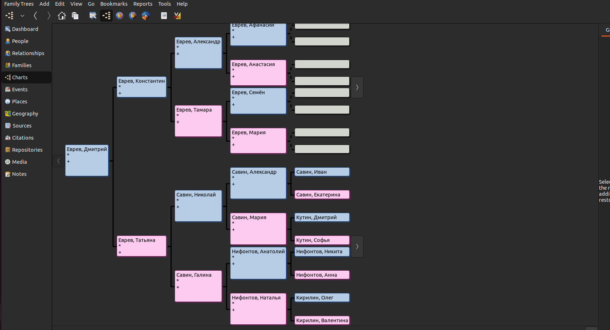

# Отчет по курсовому проекту
## по курсу "Логическое программирование"

### студент: Кирилин И.О

## Результат проверки

Вариант задания:

 - [ ] стандартный, без NLP (на 3)
 - [x] стандартный, с NLP (на 3-4)
 - [ ] продвинутый (на 3-5)
 
| Преподаватель     | Дата         |  Оценка       |
|-------------------|--------------|---------------|
| Сошников Д.В. |              |               |
| Левинская М.А.|              |               |


## Введение

Опишите, какие знания и навыки вы получите в результате выполнения курсового проекта

## Задание


Создать родословное дерево своего рода на несколько поколений (3-4) назад в стандартном формате GEDCOM. Для этого рекомендуется использовать сервис MyHeritage.com, зарегистрировавшись в нем и подключив к заполнению дерева других родственников (указав их контактный e-mail при регистрации, что приведет к автоматической рассылке приглашения на их адрес). Если Вы по каким-то причинам не хотите использовать свою родословную - вы можете использовать файл родословной европейской знати.
Преобразовать файл в формате GEDCOM в набор утверждений на языке Prolog, используя одно из следующих представлений в зависимости от номера в группе в соответствии с формулой ((N-1)+3) mod 4 + 1:
---
Вариант 3: С использованием предиката child(ребенок, родитель), male(человек), female(человек)
Реализовать предикат проверки/поиска следующих родственников в соответствии с номером варианта ((N-1) mod 7)+1:
---
Вариант 1: Шурин
Реализовать программу на языке Prolog, которая позволит определять степень родства двух произвольных индивидуумов в дереве, например:
```
?- relative(brother, ‘Петя’, X).
X = ‘Вася’
?- relative(W,’Петя’,’Вася’).
X = brother
X = child – father     
% т.е. Вася является ребенком отца Пети
X = child – mother  
% т.е. Вася является ребенком матери Пети
```
## Получение родословного дерева
Использовалась программа Gramps под Linux. Вывод программы:

## Конвертация родословного дерева

Для извлечения данных из генеологического древа использовался язык Python^
```
file = open("tree.ged", "r", encoding='utf-8')
relative = {}
```
Открытие файла и сохранение словаря
```
for string in file.readlines():

    if string.find('INDI') != -1:
        ID = string.split(' ')[1].rstrip()
    elif (string.find('GIVN')) != -1:
        name_and_surname = string.split(' ')[2].rstrip()
    elif string.find('SURN') != -1:
        name_and_surname = name_and_surname + ' ' + string.split(' ')[2].rstrip()
    elif string.find('SEX') != -1:
        if string.split(' ')[2].rstrip() == 'F':
            ancestor[ID] = [name_and_surname, '-1', '-1', 'female']
        else:
            ancestor[ID] = [name_and_surname, '-1', '-1', 'male']

    if string.find('HUSB') != -1:
        father = ancestor[string.split(' ')[2].rstrip()][0]
    elif string.find('WIFE') != -1:
        mother = ancestor[string.split(' ')[2].rstrip()][0]
    elif string.find('CHIL') != -1:
        ancestor[string.split(' ')[2].rstrip()][1] = father
        ancestor[string.split(' ')[2].rstrip()][2] = mother

file.close()
```
Построчное чтение файла и сам парсинг
```
outfile = open("tree.pl", "w")

for i in ancestor:
    if ancestor[i][1] != '-1':
        outfile.write("child('" + ancestor[i][0] + "','" + ancestor[i][1] + "').\n")
    if ancestor[i][2] != '-1':
        outfile.write("child('" + ancestor[i][0] + "','" + ancestor[i][2] + "').\n")

for i in ancestor:
    if ancestor[i][3] == 'male':
        outfile.write(ancestor[i][3] + "('" + ancestor[i][0] + "').\n")

for i in ancestor:
    if ancestor[i][3] == 'female':
        outfile.write(ancestor[i][3] + "('" + ancestor[i][0] + "').\n")

outfile.close()
```
Закрытие исходного файла и сооздание формата pl со всеми необходимыми изменениями, где будут использоваться соответсвующие предикаты
## Предикат поиска родственника

Для определения, является ли N шурином, используется следующий предикат. Сначала проверяется, существует ли жена, у которой есть брат от общих родителей. Затем проводится проверка наличия общего ребенка между этой женой и потенциальным шурином. Далее выполняется проверка того, что выбранный человек является мужчиной и не совпадает с мужем этой жены.
```
brother_in_law(X, Husband) :-
child(Wife, Parent), child(X, Parent),
child(R, Wife), child(R, Husband),
X\= Husband,
male(X).
```
## Определение степени родства

```
husband(X,Y):-
    child(Z,X),
    child(Z,Y),
    X \= Y,
    male(X).

check(husband,X,Y):- 
    husband(X,Y).
```
Изначально, я определил предикаты для определения ближайших родственных связей и внес проверку отношений в код. В этом фрагменте кода представлен пример проверки, основанной на проверке мужа.
``` 
accordance([_],T,T).
accordance([First,Second|Tail],T,R):-
    check(Relation,First,Second),
    add(Relation,T,X),
    accordance([Second|Tail],X,R),!.

search_in_width(X,Y,P):-
    width([[X]],Y,L),
    reverse(L,P).

width([[Finish|T]|_],Finish,[Finish|T]).

width([Next|B],Finish,Ans):-
    findall(X,prolong(Next,X),T),
    append(B,T,Bn),
    width(Bn,Finish,Ans),!.

width([_|T],Finish,Ans):-
    width(T,Finish,Ans).

relative(X, Y, Z):-
    search_in_width(Y, Z, R),!,
    accordance(R,[] ,X).
```
Для определения степени родства, я принял решение использовать алгоритм поиска в ширину. Для этого предикат "accordance" преобразует список родственников в список родственных связей, используя ранее созданный предикат "check", и предикат "add".
После завершения поиска, у меня есть список родственников, который затем преобразуется в список родственных связей с помощью предиката "accordance".
## Результаты
?- relative(X,'Дмитрий Еврев','Татьяна Еврев').
X = [son].

?- relative(X,'Дмитрий Еврев','Константин Еврев').
X = [son].

?- relative(X,'Дмитрий Еврев','Александра Еврев').
X = [brother].

## Выводы
В результате выполнения проекта было достигнуто понимание и применение логического программирования на практике. Была разработана программа, способная определять степень родства между индивидуумами в генеалогическом дереве. Проект демонстрирует, как можно использовать логическое программирование для анализа и обработки данных в контексте генеалогических исследований.

В целом, выполнение курсового проекта позволило углубить знания в области логического программирования и применить их на практике для решения конкретной задачи.
